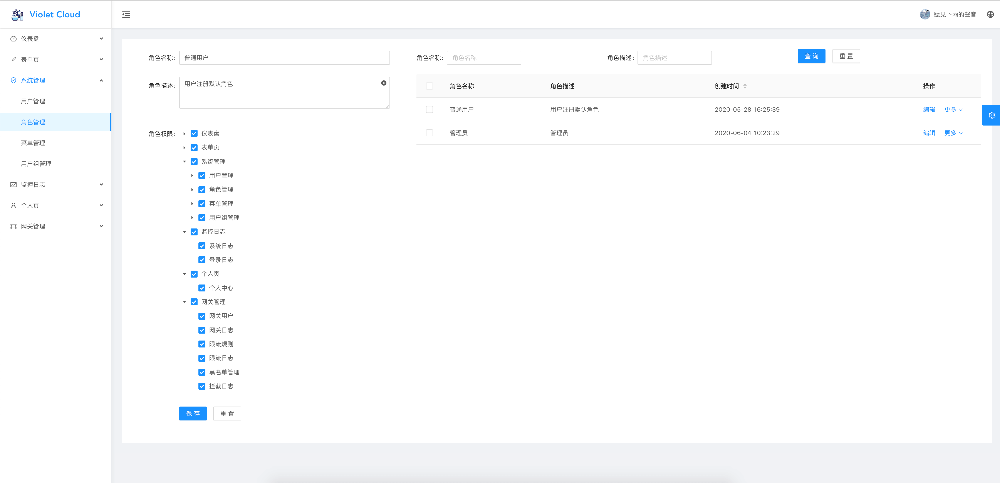
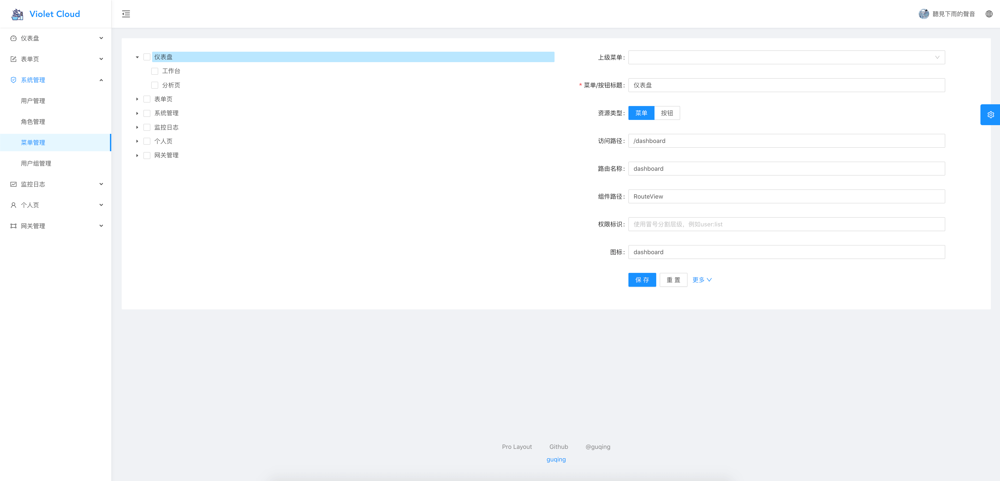
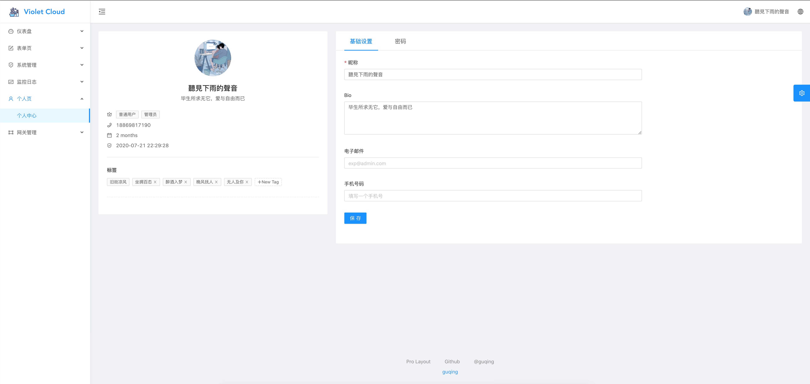

English | [简体中文](./README.zh-CN.md)

<h1 align="center">Violet Cloud Web</h1>
<div align="center">
An Micro service rapid development scaffold use <a href="#" target="_blank">Ant Design of Vue</a>
</div>

<div align="center">

[](https://gitpod.io/#https://github.com/guqing/violet-cloud-web)


</div>

### Env and dependencies

- node
- yarn
- webpack
- eslint
- @vue/cli ~3
- [ant-design-vue](https://github.com/vueComponent/ant-design-vue) - Ant Design Of Vue 
- [vue-cropper](https://github.com/xyxiao001/vue-cropper) - Picture edit
- [@antv/g2](https://antv.alipay.com/zh-cn/index.html) - AntV G2
- [Viser-vue](https://viserjs.github.io/docs.html#/viser/guide/installation)  - Antv/G2 of Vue

> Note:  [Yarn](https://yarnpkg.com/) package management is recommended, the exact same version loaded with the demo site of this project (yarn.lock) . but you can also use npm

### Preview






### Project setup

- Clone repo
```bash
git clone https://github.com/guqing/violet-cloud-web.git
cd violet-cloud-web
```

- Install dependencies
```
yarn install
```

- Compiles and hot-reloads for development
```
yarn run serve
```

- Compiles and minifies for production
```
yarn run build
```

- Lints and fixes files
```
yarn run lint
```


### Other

- **IMPORTANT : About Issue feedback !! when opening Issue read [Issue / PR Contributing](./docs/issues.md)**

- [Vue-cli3](https://cli.vuejs.org/guide/) used by the project.

- Disable Eslint (not recommended): remove `eslintConfig`  field in `package.json`  and `vue.config.js` field `lintOnSave: false`

- Load on Demand `/src/main.js` L14, in `import './core/lazy_use'`, `import './core/use''`. more [load-on-demand.md](./docs/load-on-demand.md)

- Customize Theme:  [Custom Theme Config (@kokoroli)](https://github.com/kokoroli/antd-awesome/blob/master/docs/Ant_Design_%E6%A0%B7%E5%BC%8F%E8%A6%86%E7%9B%96.md)

- I18n: [locales (@musnow)](./src/locales/index.js)

- Production env `mock` is disabled. use `src/mock/index.js`

## Browsers support

Modern browsers and IE10.

| [](http://godban.github.io/browsers-support-badges/)</br>IE / Edge | [](http://godban.github.io/browsers-support-badges/)</br>Firefox | [](http://godban.github.io/browsers-support-badges/)</br>Chrome | [](http://godban.github.io/browsers-support-badges/)</br>Safari | [](http://godban.github.io/browsers-support-badges/)</br>Opera |
| --- | --- | --- | --- | --- |
| IE10, Edge | last 2 versions | last 2 versions | last 2 versions | last 2 versions |
